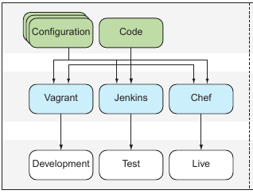

# Life before docker 

Before docker, the development pipeline typically involved combinations of various technologies for managing the movement of software, such as virtual machines, configuration management tools, package management systems, and complex web of library dependencies. All tools need to be managed and maintained by specialist engineers, and most had  their own unique ways of being configured. 

